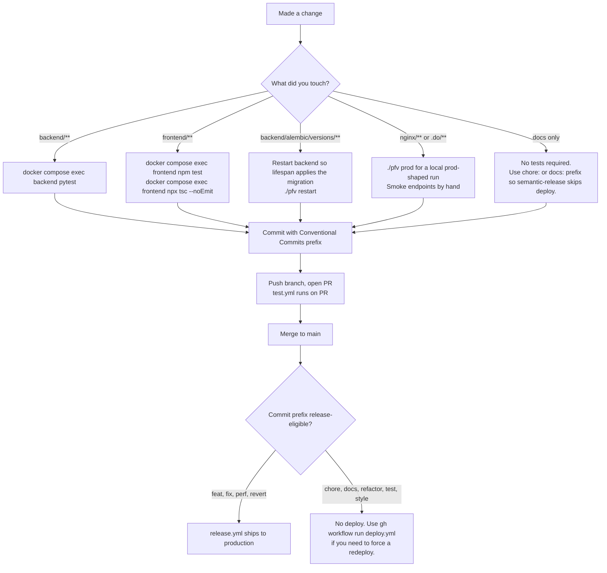

# Contributing to The Better Decision

This guide gets a new contributor productive in under 30 minutes: local stack up, tests passing, first PR ready to push. For deep references, follow the cross-links instead of reading this file end-to-end.

Sibling docs you will end up at:

- `README.md` for product overview and stack.
- `ENVIRONMENT.md` for every env var, with scopes, defaults, and failure modes.
- `DEPLOYMENT.md` for the full CI/CD pipeline (what fires when, how production deploys, smoke tests, apex domain).
- `infra/README.md` and `infra/MIGRATION.md` for the production data plane and Terraform workflow.
- `BRAND.md` and `DESIGN.md` for product copy and UI conventions.

## Prerequisites

- Docker and Docker Compose.
- Git.
- Node.js 22+ on the host (only needed if you want `tsc` outside the container). The app itself runs entirely in containers.

## Quickstart (under 30 minutes)

```bash
# 1. Clone and configure
git clone https://github.com/flamarion/pfv.git && cd pfv
cp .env.example .env

# 2. Generate a real JWT secret. The backend refuses to boot on the placeholder.
python -c "import secrets; print(secrets.token_urlsafe(64))"
# Paste that value into JWT_SECRET_KEY in .env

# 3. Start the dev stack (MySQL + Redis + backend + frontend + nginx)
./pfv start

# 4. Open the app
open http://localhost
```

The first user to register becomes the org owner and superadmin. No seed data required.

Want a realistic dataset (5 accounts, 100+ transactions, recurring templates, budgets)?

```bash
./pfv seed                 # creates demo / demo1234
```

For a custom user, set `SEED_*` env vars before the command. See [Seeding mock data](#seeding-mock-data) below.

Full env var reference, including production-only and feature-flag variables, lives in `ENVIRONMENT.md`. Do not duplicate values here.

## Your first PR



If you touched migrations, run `docker compose exec backend alembic current` and `docker compose exec backend alembic upgrade head` inside the container to confirm. See [Database migrations](#database-migrations).

## Conventional Commits and the deploy gate

This repo is auto-deployed by `semantic-release` on push to `main`. The commit prefix is the deploy decision, not a stylistic detail.

| Prefix | Release? | What ships |
|--------|----------|------------|
| `feat:` | Yes (minor bump) | App Platform redeploy + smoke tests |
| `fix:` | Yes (patch bump) | App Platform redeploy + smoke tests |
| `perf:` | Yes (patch bump) | App Platform redeploy + smoke tests |
| `revert:` | Yes (patch bump) | App Platform redeploy + smoke tests |
| `feat!:`, `BREAKING CHANGE:` footer | Yes (major bump) | App Platform redeploy + smoke tests |
| `chore:`, `docs:`, `refactor:`, `test:`, `style:`, `ci:`, `build:` | No | Nothing. CI runs `test.yml` only. |

Scope is freeform (`feat(admin):`, `fix(frontend):`, `chore(.do):`). Scope does not change release behavior.

Rules in practice:

- If your change should reach production on merge, use `feat:`, `fix:`, or `perf:`.
- If your change is internal only (refactor, test fix, doc edit, CI tweak, dependency bump), use `chore:` / `docs:` / `refactor:` / `test:`. The merge will not redeploy. This is the right answer most of the time for non-product changes.
- Infra-only changes (`chore(.do)`, `chore(infra)`, `chore(nginx)`) sometimes need to ship without a version bump. Use the manual escape hatch: `gh workflow run deploy.yml --ref main`. See `DEPLOYMENT.md` for when this is appropriate.

Full pipeline detail (path filters, gating logic, smoke tests, apex deploy) lives in `DEPLOYMENT.md`. The short version is in [CI on your PR vs CI after merge](#ci-on-your-pr-vs-ci-after-merge) below.

## CI on your PR vs CI after merge

PR push (any branch):

- `.github/workflows/test.yml` runs on changes under `backend/**`, `frontend/**`, or `.github/workflows/test.yml`. Backend: `pytest` + compileall syntax smoke. Frontend: lint, design-token check, `vitest`/`jest`, production build.
- Nothing deploys. Nothing reaches production.

Merge to `main`:

- `.github/workflows/release.yml` runs on changes under `backend/**`, `frontend/**`, `nginx/**`, `.do/**`, or `Dockerfile*`. It runs `semantic-release`. If (and only if) `semantic-release` decides a new release is warranted, the gated `deploy` job pushes `.do/app.yaml` to DO App Platform, then `scripts/smoke-test.sh` asserts the live app serves traffic.
- `chore:` / `docs:` / `refactor:` commits inside the allowlist still trigger `release.yml`, but `semantic-release` no-ops and the deploy job is skipped.
- `.github/workflows/apex-deploy.yml` deploys the apex landing site (`thebetterdecision.com`) to AWS S3 + CloudFront on merges that touch the apex path filter. Independent of the DO release pipeline; landing-only commits never fire the DO redeploy.

If you need to force a redeploy of the current production spec without merging a code change, use the manual workflow:

```bash
gh workflow run deploy.yml --ref main
```

`DEPLOYMENT.md` is the authoritative reference.

## Working in parallel agent sessions

If you dispatch Claude Code agents (or any parallel-process helpers) against this repo, never let them run backend tests or migrations against the default `pfv` Docker Compose project. They will write to your local MySQL volume. Use an isolated compose project name on every command:

```bash
docker compose -p team-<unique-name> up -d backend mysql redis
docker compose -p team-<unique-name> exec backend pytest tests/...
```

A single command that omits `-p team-<name>` falls back to the default `pfv` project and contaminates the user's stack. `./pfv migrate` has no `-p` flag and always targets the default project, so agents must not invoke it either. See `CLAUDE.md` for the full rule and the 2026-05-09 incident this guard prevents.

## Seeding mock data

```bash
./pfv seed                                       # default demo user
SEED_USERNAME=alice SEED_PASSWORD=alice1234 \
SEED_EMAIL=alice@example.com SEED_ORG="Alice LLC" \
./pfv seed                                       # custom user
```

The seed script registers the user if it does not exist, logs in, and creates data. If the user already exists, it adds data to their org.

`SEED_*` env var reference:

| Variable | Default |
|----------|---------|
| `SEED_USERNAME` | `demo` |
| `SEED_PASSWORD` | `demo1234` |
| `SEED_EMAIL` | `demo@example.com` |
| `SEED_FIRST_NAME` | `Demo` |
| `SEED_LAST_NAME` | `User` |
| `SEED_ORG` | `Demo Household` |

## CLI reference

| Command | Description |
|---------|-------------|
| `./pfv start` | Build and start all dev services |
| `./pfv stop` | Stop all services |
| `./pfv restart` | Restart without rebuild |
| `./pfv rebuild` | Force rebuild (no cache) and start |
| `./pfv reset` | Destroy all data, rotate JWT secret, start fresh |
| `./pfv prod` | Build and start a local prod-shaped stack |
| `./pfv migrate` | Run pending DB migrations (local only) |
| `./pfv logs [svc]` | Tail logs (`backend`, `frontend`, `nginx`, `mysql`, `redis`) |
| `./pfv status` | Container status |
| `./pfv shell [svc]` | Shell into a service (default: `backend`) |
| `./pfv seed` | Populate with mock data |

## Architecture

```
Browser --> nginx (:80) --> /api/*  --> backend (FastAPI :8000) --> MySQL (:3306)
                        --> /*      --> frontend (Next.js :3000)
                                        backend --> Redis (:6379)
```

In production (DigitalOcean App Platform), nginx is replaced by DO's built-in ingress. MySQL and Redis are self-hosted on a single droplet (`pfv-data-01`) in a private VPC. Background and runbook: `infra/README.md`, `infra/MIGRATION.md`.

### Backend layout

```
backend/app/
├── main.py          # FastAPI app, lifespan, CORS, router registration
├── config.py        # pydantic-settings, all config from env vars
├── database.py      # async SQLAlchemy engine + session factory
├── security.py      # JWT encode/decode, bcrypt hash/verify
├── deps.py          # FastAPI dependencies: get_db, get_current_user
├── logging.py       # structlog JSON setup
├── models/          # SQLAlchemy ORM models
├── schemas/         # Pydantic request/response models
├── routers/         # API route handlers (one file per resource)
└── services/        # Business logic called by routers
```

### Frontend layout

```
frontend/
├── app/             # Next.js App Router pages (one folder per route)
├── components/      # React components, grouped by feature
└── lib/
    ├── api.ts       # Typed fetch wrapper with Bearer token + silent refresh
    ├── types.ts     # Shared TypeScript interfaces
    ├── styles.ts    # Tailwind class constants (btnPrimary, card, input, ...)
    ├── auth.ts      # isAdmin() / role helpers
    └── validation.ts # Client-side validation mirroring backend schemas
```

For the full router-by-router and service-by-service map, see the live file tree under `backend/app/` and `frontend/app/`. We intentionally do not duplicate the directory listing in this doc because it ages out within weeks.

### Key design decisions

- **All config via env vars.** `pydantic-settings` in backend, `NEXT_PUBLIC_` prefix in frontend. See `ENVIRONMENT.md`.
- **Stateless backend.** No in-memory state. JWT for auth. Ready for horizontal scaling.
- **Migrations auto-run on startup in dev.** In production they run as a `PRE_DEPLOY` job (App Platform) or initContainer (k8s) before the app starts. See [Database migrations](#database-migrations).
- **First user is superadmin.** No bootstrap seed needed.
- **Org-scoped data.** Every query filters by `org_id`.
- **API versioned at `/api/v1/`.** Breaking changes ship as `/api/v2/` while v1 stays live.
- **Auth on every endpoint.** Use `get_current_user`. Public endpoints are listed in `backend/app/deps.py`.
- **Hierarchical categories.** Master categories for budgets, subcategories as transaction tags. Type (income / expense / both) is enforced server-side; once a category is used the UI locks the type.
- **Transfer category invariant.** Transfer legs require a `CategoryType.BOTH` category (seeded as `Transfer`).
- **Billing periods.** Org-level month close date. `COALESCE(settled_date, date)` determines which period a transaction counts against.
- **Audit trail.** Sensitive admin and org actions (rename, wipe, override sweep, role edits) write to `audit_events` and surface at `/admin/audit`.

## Authentication and security

### Auth flow

1. **Login.** `POST /api/v1/auth/login` with username/email + password, or Google SSO via `/api/v1/auth/google`.
2. **MFA challenge** (if enabled). Returns `mfa_token`, user completes TOTP, recovery code, or email verification.
3. **Tokens issued.** Access token (15 min, response body) + refresh token (7 day, httpOnly cookie).
4. **Silent refresh.** Frontend auto-refreshes via `POST /api/v1/auth/refresh` on 401.
5. **Absolute session lifetime.** Sessions expire after `SESSION_LIFETIME_DAYS` (default 30) regardless of refresh activity.

### SSO password security

Google-SSO users have `password_set=False` until they explicitly set a password. To prevent a hijacked SSO session from silently attaching a password:

- **First password set** requires a Google **step-up** verification. The user re-authenticates with the same Google account, the backend issues a 5-minute single-use step-up token, and only then accepts the password write.
- **Reset password via email token** (the standard `/forgot-password` then `/reset-password` flow) flips `password_set=True` on success.
- **Step-up callbacks** redirect through a server-side allowlist of `return_to` keys. Arbitrary URLs are rejected with `400 Malformed step-up state`.
- **Email change** also takes the step-up path and flips `password_set` back to `False` if the new email belongs to a different identity.

### MFA

- TOTP via authenticator app (Google Authenticator, Authy, 1Password).
- 8 single-use recovery codes (HMAC-SHA256 hashed, downloadable).
- Email fallback with 6-digit code (10-minute expiry).
- TOTP secrets encrypted at rest via Fernet (`MFA_ENCRYPTION_KEY`).
- Setup and disable via `/settings/security`.

### Rate limiting

All limits are per client IP via slowapi. Production and Docker Compose use Redis / Valkey-backed storage (shipped in K8S-1, see `backend/app/rate_limit.py`); in-memory storage is the fallback when `REDIS_URL` is empty. Storage errors fail open so a Redis blip never blocks legitimate traffic.

| Endpoint | Limit |
|----------|-------|
| `POST /api/v1/auth/login` | 10/minute |
| `POST /api/v1/auth/register` | 5/hour |
| `GET /api/v1/auth/check-username` | 20/minute |
| `POST /api/v1/auth/verify-email` | 10/minute |
| `POST /api/v1/auth/resend-verification` | 3/hour |
| `POST /api/v1/auth/forgot-password` | 5/minute |
| `POST /api/v1/auth/mfa/verify` | 10/minute |
| `POST /api/v1/auth/mfa/recovery` | 10/minute |
| `POST /api/v1/auth/mfa/email-code` | 3/minute |
| `POST /api/v1/auth/mfa/email-verify` | 10/minute |

### Public endpoints (no auth required)

`/health`, `/ready`, `/api/v1/auth/status`, `/api/v1/auth/login`, `/api/v1/auth/register`, `/api/v1/auth/refresh`, `/api/v1/auth/forgot-password`, `/api/v1/auth/reset-password`, `/api/v1/auth/verify-email`, `/api/v1/auth/google`, `/api/v1/auth/google/callback`, plus the `/api/v1/auth/mfa/*` challenge endpoints.

All other endpoints require a Bearer access token via the `get_current_user` dependency.

## Environment variables

See `ENVIRONMENT.md`. It is the authoritative reference for every backend, frontend, migrate, and CLI variable, with scopes, defaults, deployment paths, and failure modes.

The minimum to boot locally is:

- `DATABASE_URL` (preconfigured in `.env.example`).
- `JWT_SECRET_KEY` (32+ chars). The backend refuses to boot on the placeholder.

To generate keys:

```bash
# JWT secret
openssl rand -hex 32

# MFA encryption key (Fernet)
python -c "from cryptography.fernet import Fernet; print(Fernet.generate_key().decode())"
```

## Database migrations

Three execution paths, picked by environment:

- **Local dev (`./pfv start`):** the backend lifespan calls `_run_migrations()` on startup against the local MySQL volume. A branch guard refuses to migrate when the host checkout is off `main` (set `PFV_MIGRATE_OK_OFF_MAIN=1` to override). See `CLAUDE.md`.
- **Local prod simulation (`./pfv prod`):** a one-shot `migrate` service defined in `docker-compose.prod.yml` runs the wrapper at `/app/scripts/migrate.py` and exits; the backend then starts with `APP_ENV=production` (no lifespan migration).
- **Production (DO App Platform):** a dedicated `PRE_DEPLOY` job runs the wrapper before any backend replica starts. Secrets (especially `DATABASE_URL`) must be configured against the `migrate` job in the DO console; App Platform does not auto-inherit secrets across components.

The wrapper at `backend/scripts/migrate.py` does not replace alembic, it drives it. It runs `alembic upgrade <revision>` one revision at a time and emits structured JSON events around each step (grep `migrate.start`, `migrate.step.start`, `migrate.step.end`, `migrate.complete`, `migrate.no_op`, `migrate.failed`). Exit code matches alembic's, so a `PRE_DEPLOY` failure blocks the deploy.

```bash
# Create a new migration
docker compose exec backend alembic revision -m "description"

# Apply pending migrations (local dev only)
./pfv migrate

# Check the current revision
docker compose exec backend alembic current
```

Migration files live at `backend/alembic/versions/` and follow sequential numbering (`001_`, `002_`, ...).

## Testing

### Backend (pytest)

Run inside the `backend` container. The dev image installs `requirements-dev.txt` because `INSTALL_DEV=true` is set in `docker-compose.yml`. Production and CI builds keep `INSTALL_DEV=false`.

```bash
# Full suite
docker compose exec backend pytest

# A single module or test
docker compose exec backend pytest tests/routers/test_auth.py
docker compose exec backend pytest tests/routers/test_auth.py::test_login_happy_path
```

Do not run `pytest` on the host. Dependencies live in the container.

If you are working through a parallel agent session, use `-p team-<name>` on every compose call. See [Working in parallel agent sessions](#working-in-parallel-agent-sessions).

### Frontend (vitest / jest)

```bash
docker compose exec frontend npm test
docker compose exec frontend npm test -- tests/lib/api.test.ts
```

### TypeScript type checking

```bash
docker compose exec frontend npx tsc --noEmit
# or, on the host
cd frontend && npx tsc --noEmit
```

### Manual smoke testing

Swagger UI at http://localhost/api/docs is the fastest way to poke a single endpoint. The browser covers UI flows; `curl` or `httpie` cover scripted checks. Production smoke tests live in `scripts/smoke-test.sh` and run automatically after `release.yml` deploys (see `DEPLOYMENT.md`).

## Branching and pull requests

- **Never push directly to `main`.** Always branch and open a PR.
- Branch naming convention: `feat/<name>`, `fix/<name>`, `chore/<name>`.
- Match the PR title to the commit prefix (`feat:`, `fix:`, ...). The PR title is what semantic-release reads if you squash-merge.
- Keep PR descriptions concise. No test plan section required.

## Deployment

The full deployment pipeline (release gating, App Platform spec, smoke tests, manual escape hatches, apex pipeline) is in `DEPLOYMENT.md`. The short version contributors need to know:

- Merges to `main` trigger `release.yml`. Whether App Platform redeploys depends on the commit prefix (see [Conventional Commits and the deploy gate](#conventional-commits-and-the-deploy-gate)).
- `.do/app.yaml` is the source of truth for App Platform config. Secrets are encrypted `EV[...]` blobs committed in-file; any secret missing from this file is removed from the live app on push.
- Terraform (`infra/terraform/`) is VCS-driven via HCP Terraform Cloud (workspace `FlamaCorp/pfv`). PRs get speculative plans; merges create runs that require manual Confirm and Apply. CLI `terraform plan` / `apply` is debug-only.
- Droplet bootstrap (`infra/ansible/`) handles MySQL, Redis, hardening, and nightly mysqldump.

## API documentation

- **Swagger UI:** http://localhost/api/docs (development).
- **OpenAPI spec:** http://localhost/api/openapi.json.

All API routes are prefixed with `/api/v1/`. Each resource has its own router under `backend/app/routers/`; see the live file tree for the current resource list.

## Troubleshooting

### Backend will not start

```bash
./pfv logs backend
```

Common causes:

- MySQL not ready. Wait for the healthcheck, then `./pfv restart`.
- Missing env var. Diff `.env` against `.env.example`.
- `JWT_SECRET_KEY` still at the placeholder or shorter than 32 chars. The config validator refuses to boot.
- Migration error. Run `./pfv migrate`. If the error mentions branch guard, set `PFV_MIGRATE_OK_OFF_MAIN=1` for this session or move to `main`.

### Frontend build fails

```bash
cd frontend && npx tsc --noEmit       # surface TS errors
./pfv rebuild                          # rebuild from scratch
```

### Database issues (local dev)

```bash
docker compose exec mysql mysql -u"$MYSQL_USER" -p"$MYSQL_PASSWORD" "$MYSQL_DATABASE"
./pfv reset                            # destroys all data, rotates JWT secret
```

### MFA locked out (local dev)

```bash
docker compose exec mysql mysql -u"$MYSQL_USER" -p"$MYSQL_PASSWORD" "$MYSQL_DATABASE" \
  -e "UPDATE users SET mfa_enabled=0, totp_secret=NULL, recovery_codes=NULL WHERE username='youruser';"
```
