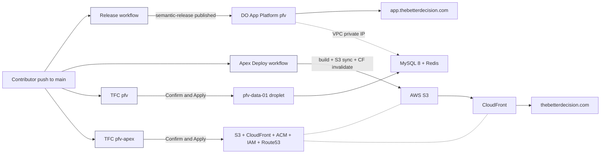
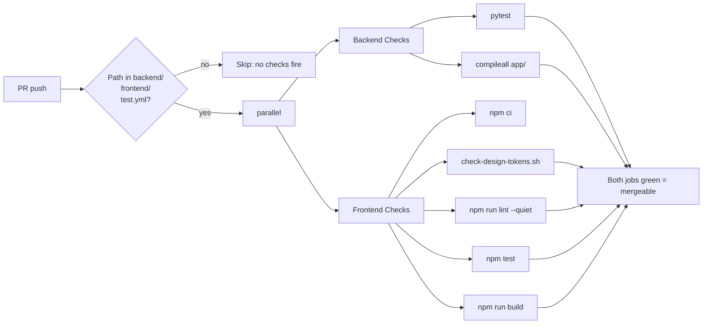
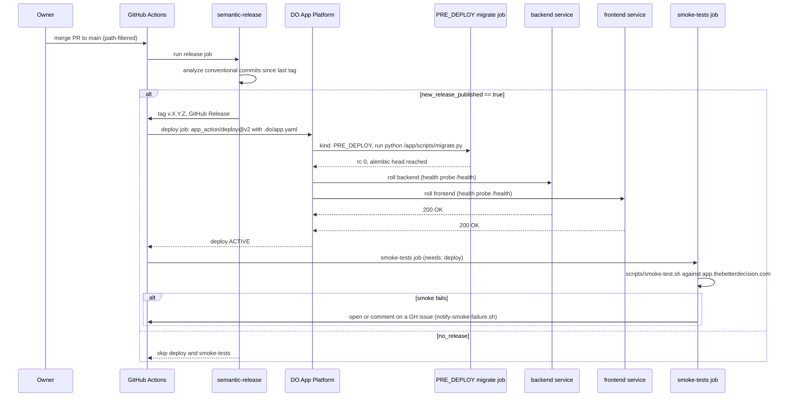
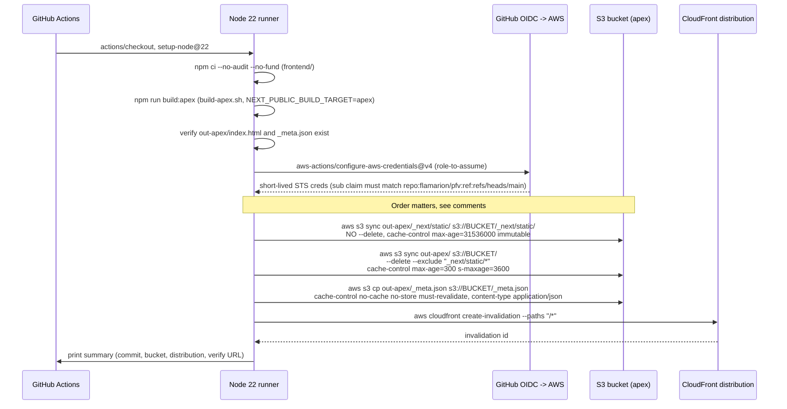
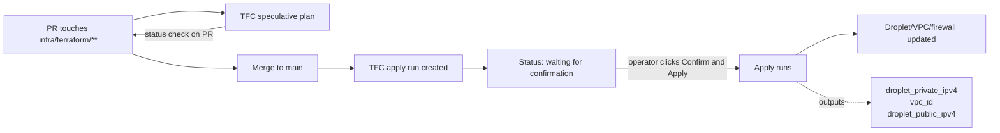
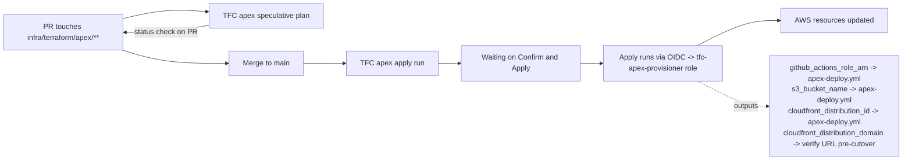
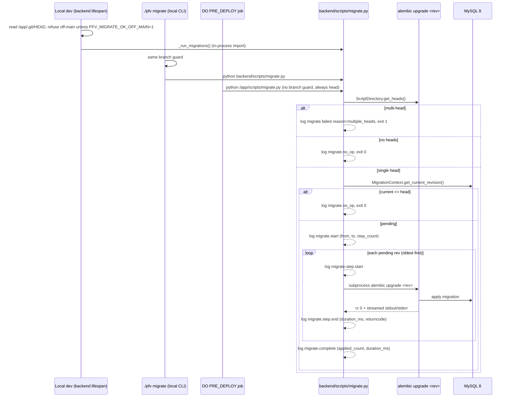
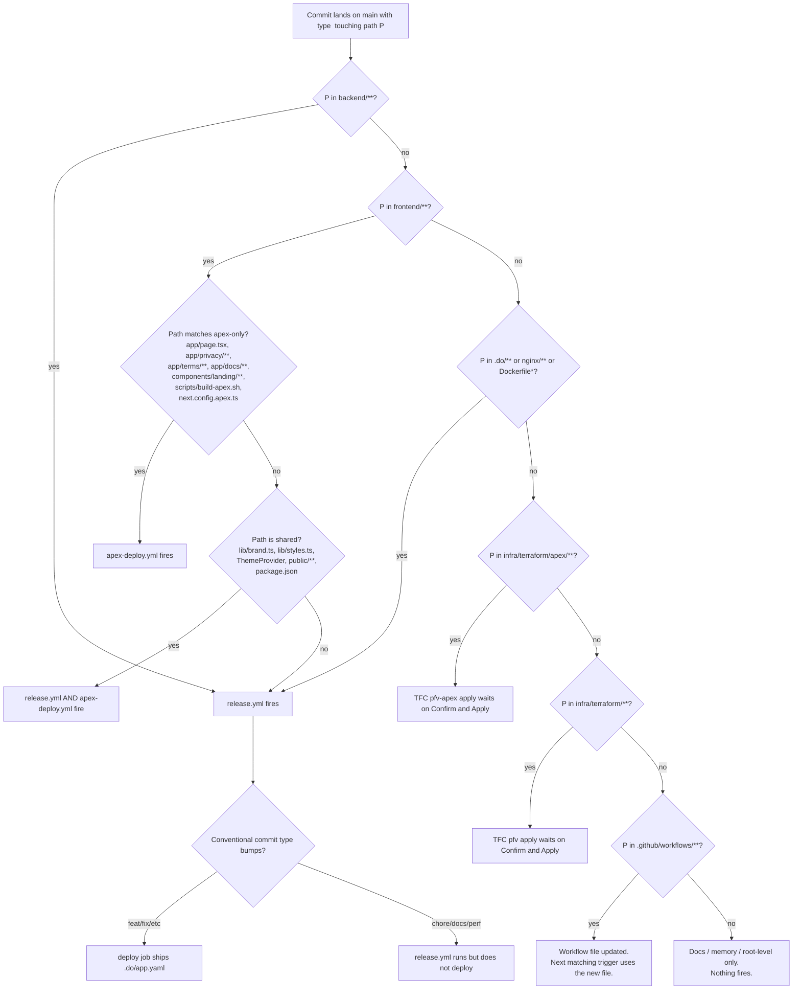

# DEPLOYMENT.md

Audience: a contributor who just cloned the repo and wants to understand what happens between `git push` and a live change at `app.thebetterdecision.com` or `thebetterdecision.com`. Also a triage reference for CI/CD failures.

All four pipelines described here are live on `main` today (`test.yml`, `release.yml`, `deploy.yml`, `apex-deploy.yml`). The apex pipeline ships content to S3 + CloudFront, but the apex DNS swap (PR-D, see Section 5) is still pending; until it lands, the apex landing is reachable only via the CloudFront-assigned hostname, not via `https://thebetterdecision.com`.

For "how do I get my code ready to push", read [`CONTRIBUTING.md`](./CONTRIBUTING.md). For the env var matrix, read [`ENVIRONMENT.md`](./ENVIRONMENT.md). For the managed-to-droplet data move, read [`infra/MIGRATION.md`](./infra/MIGRATION.md). This file does not duplicate any of them.

## 1. Overview

Four production surfaces. Each has its own pipeline. Some changes fan out across more than one.

| Surface | URL | Hosted by | Updated by |
|---|---|---|---|
| App (FastAPI + Next.js dashboard) | `https://app.thebetterdecision.com` | DigitalOcean App Platform (`pfv` app) | `release.yml` (auto) or `deploy.yml` (manual) |
| Apex landing (marketing, privacy, terms, docs) | `https://thebetterdecision.com` (DNS pending PR-D) | AWS S3 + CloudFront | `apex-deploy.yml` (auto) |
| Data plane (MySQL 8 + Redis) | private VPC IP `10.42.x.x:3306 / :6379` | Self-hosted DO droplet `pfv-data-01` | TFC workspace `FlamaCorp/pfv` (manual confirm) |
| Apex CDN + cert + IAM | n/a (control plane) | AWS (S3, CloudFront, ACM, IAM, Route 53) | TFC workspace `FlamaCorp/pfv-apex` (manual confirm) |



The data plane is reached by App Platform over the VPC's private IPv4. The apex CDN bucket is reached by GitHub Actions over the public AWS API using OIDC-issued credentials, not long-lived keys.

## 2. PR lifecycle (`test.yml`)

Source: `.github/workflows/test.yml`.

`test.yml` is the only CI workflow that runs on PRs. It does **not** deploy anything. Its job is to fail loud before code reaches `main`.

Triggers:
- `pull_request` with path filter on `backend/**`, `frontend/**`, or `.github/workflows/test.yml`
- `workflow_dispatch` (manual)

`concurrency.group = test-${workflow}-${ref}` with `cancel-in-progress: true`. Pushing a new commit to the PR cancels the prior run.

Two jobs run in parallel:

| Job | Steps | Failure means |
|---|---|---|
| **Backend Checks** | Python 3.12, `pip install -r backend/requirements-dev.txt`, `pytest`, then `python -m compileall backend/app` | Pytest failed, or a syntax error slipped in that pytest didn't reach |
| **Frontend Checks** | Node 22, `npm ci`, `scripts/check-design-tokens.sh`, `npm run lint -- --quiet`, `npm test`, `npm run build` | One of: design-token violation, lint error, test failure, production build failure |

Both must pass for merge (branch protection rule).



How to read failures:
- **Design tokens**: `frontend/scripts/check-design-tokens.sh` scans for hard-coded colors / spacings that should use brand tokens. Output names the file and line.
- **Lint**: `npm run lint -- --quiet` shows only errors (warnings are tolerated; treat warnings shown in logs as informational).
- **Frontend build**: a build failure here means it will also fail in production. Test locally with `docker compose exec frontend npm run build`.
- **Pytest**: known-flaky `tests/app/transactions-page.test.tsx` does not run here (that's a Jest test). For backend flake see `~/.claude/projects/-Users-fjorge-src-pfv/memory/` references; otherwise the failure is real.

Re-run a single job from the PR's Checks tab.

## 3. Backend + Frontend production deploy (`release.yml`)

Source: `.github/workflows/release.yml`. Spec: `.do/app.yaml`.

`release.yml` is the **single arbiter** of "should we ship to prod". It runs on every push to `main` whose changed paths intersect a coarse allowlist, and uses **semantic-release** to decide whether the merge warrants a new version. If yes, the gated `deploy` job pushes `.do/app.yaml` to DO App Platform; DO runs the `PRE_DEPLOY` migrate job, then rolls the backend and frontend services; then `smoke-tests` asserts the live app actually serves traffic.

### Trigger

```yaml
on:
  push:
    branches: [main]
    paths:
      - "backend/**"
      - "frontend/**"
      - "nginx/**"
      - ".do/**"
      - "Dockerfile*"
```

This path filter is a **coarse precheck**, not the deploy gate. Pushes that don't touch any allowlisted path skip the workflow entirely (no CI minutes spent). Pushes that do touch one still run, and then semantic-release inside the workflow makes the real ship/no-ship call based on conventional commit types (`feat:`, `fix:`, etc).

Why this design: pre-PR #178 the workflow shipped on every allowlisted change, which meant a `chore(frontend): tsconfig` merge would redeploy production for no reason. Semantic-release suppresses `chore:`, `perf:`, `docs:`, `refactor:`, etc. and only ships when a `feat:` or `fix:` (or higher) gets merged.

### Job graph



### The gate

```yaml
deploy:
  needs: release
  if: needs.release.outputs.new_release_published == 'true'
```

This is the load-bearing line. Without `new_release_published`, `deploy` does not run, `smoke-tests` does not run, nothing ships. The output is set by `cycjimmy/semantic-release-action@v6` based on whether the conventional-commit analysis produced a new version.

### Why a gated `deploy` job and not `on: release: { types: [published] }`

GitHub does not cascade workflow runs when a release is created by `GITHUB_TOKEN`, which is what semantic-release uses. A separate workflow listening on `release.published` would never fire. So `deploy` lives in the same workflow file and gates on the upstream job's output.

### Deploy step internals

`digitalocean/app_action/deploy@v2` with `app_spec_location: .do/app.yaml` and **no `app_name`**. With both set, the action ignores the file and fetches the live spec by name (that bug let PR #79's migration sit un-applied for hours). The action reads `.do/app.yaml` and picks up the app via its top-level `name: pfv` field. The current spec drives every deploy, which means:

- Every SECRET must be declared in `.do/app.yaml` with its encrypted `EV[...]` value, or it gets removed from the live app on push. (See ENVIRONMENT.md "Spec-sync hazards" and the file's own preamble comment.)
- Every domain, env var, ingress rule, and component must be present and current in the file.

### `PRE_DEPLOY` migrate job

Declared in `.do/app.yaml` as:

```yaml
jobs:
  - name: migrate
    kind: PRE_DEPLOY
    source_dir: backend
    dockerfile_path: backend/Dockerfile
    run_command: python /app/scripts/migrate.py
```

App Platform holds the new revision back until this job exits 0. A long migration never causes the backend's serving probe to fail because the backend doesn't start serving until migrate is done. See Section 8 for migration details.

### Smoke tests

`scripts/smoke-test.sh` runs after `deploy` succeeds. Env: `SMOKE_BASE_URL=https://app.thebetterdecision.com`, plus a `SMOKE_USERNAME` / `SMOKE_PASSWORD` for a dedicated smoke user. The smoke user must exist, must be `email_verified`, and must **not** have MFA enabled.

On failure, `scripts/notify-smoke-failure.sh` opens (or comments on an existing) GitHub issue using `GH_TOKEN`. DO marking the deploy `ACTIVE` is necessary but not sufficient: smoke tests assert end-to-end traffic actually works.

### How to verify a deploy

1. Watch the workflow run: `https://github.com/flamarion/pfv/actions/workflows/release.yml`
2. Watch the DO deploy: DO console -> Apps -> `pfv` -> Activity. The PRE_DEPLOY job logs appear first; structured `migrate.*` JSON events stream there.
3. Inspect the running app: `curl -fsS https://app.thebetterdecision.com/health` and `curl -fsS https://app.thebetterdecision.com/ready`.

## 4. Manual deploy escape hatch (`deploy.yml`)

Source: `.github/workflows/deploy.yml`.

`deploy.yml` mirrors `release.yml`'s `deploy` + `smoke-tests` jobs. It is triggered exclusively by `workflow_dispatch`:

```bash
gh workflow run deploy.yml --ref main
```

When to use it:
- An infra-only commit shipped (`chore(.do): ...`, `chore(nginx): ...`, `chore(Dockerfile): ...`). semantic-release will not bump for `chore:`, so `release.yml` will not deploy. Run `deploy.yml` to push the new spec.
- The most recent `release.yml` run failed at the deploy step and the cause is fixed, but no new release will be cut from a follow-up commit.
- Forcing a redeploy of the current `main` (e.g. to refresh credentials surfaced via the spec).

What it does: same `app_action/deploy@v2` + `.do/app.yaml`, same PRE_DEPLOY migrate, same smoke tests. Auth is the same `DIGITALOCEAN_ACCESS_TOKEN` secret.

What it does NOT do: bump a version, create a tag, or post to a release feed. It is a deploy-only escape hatch.

For rollback to a prior `main` SHA, see Section 10.

## 5. Apex landing deploy (`apex-deploy.yml`)

> Workflow is live on `main` (shipped in PR #267). It deploys to S3 + CloudFront on every push to `main` whose paths match the filter below. The apex hostname `https://thebetterdecision.com` is not wired to DNS yet (that lands with PR-D); until then, verify deploys against the CloudFront-assigned hostname from the TFC output `cloudfront_distribution_domain`.

The apex landing (`thebetterdecision.com`) is a Next.js static export. `frontend/scripts/build-apex.sh` produces `frontend/out-apex/`. The workflow uploads that directory to an S3 bucket fronted by CloudFront in AWS, using **GitHub OIDC** to assume an IAM role (no long-lived AWS keys committed anywhere). The bucket, distribution, ACM cert, and IAM roles are provisioned by the `FlamaCorp/pfv-apex` TFC workspace (Section 7).

### Trigger and path filter

```yaml
on:
  push:
    branches: [main]
    paths:
      # Landing surface
      - "frontend/app/page.tsx"
      - "frontend/app/privacy/**"
      - "frontend/app/terms/**"
      - "frontend/app/docs/**"
      # Structural retained app files
      - "frontend/app/layout.tsx"
      - "frontend/app/not-found.tsx"
      - "frontend/app/error.tsx"
      - "frontend/app/loading.tsx"
      - "frontend/app/global-error.tsx"
      - "frontend/app/icon.svg"
      - "frontend/app/globals.css"
      # Landing components and apex-build helpers
      - "frontend/components/landing/**"
      - "frontend/components/auth/AuthProviderApex.tsx"
      - "frontend/scripts/build-apex.sh"
      - "frontend/next.config.apex.ts"
      - "frontend/lib/links.ts"
      # Shared brand and styling
      - "frontend/lib/brand.ts"
      - "frontend/lib/site.ts"
      - "frontend/lib/styles.ts"
      - "frontend/components/brand/**"
      - "frontend/components/ThemeProvider.tsx"
      - "frontend/components/tour/**"
      - "frontend/components/ui/BackLink.tsx"
      - "frontend/components/ui/CurrentYear.tsx"
      - "frontend/components/ui/ThemeToggle.tsx"
      - "frontend/public/**"
      # Build inputs
      - "frontend/package.json"
      - "frontend/package-lock.json"
      # The workflow itself
      - ".github/workflows/apex-deploy.yml"
```

Shared paths (`frontend/lib/brand.ts`, `frontend/lib/styles.ts`, `frontend/components/ThemeProvider.tsx`, `frontend/public/**`, `frontend/package.json`, etc.) are also on `release.yml`'s allowlist. A change to any of these legitimately affects both surfaces and triggers both pipelines.

Landing-only paths (`frontend/app/page.tsx`, `frontend/app/privacy/**`, `frontend/components/landing/**`, etc.) are **not** on `release.yml`'s allowlist, so a landing-only commit skips the DO release entirely. That is the intended split.

### Permissions and concurrency

```yaml
permissions:
  contents: read
  id-token: write   # required for OIDC to AWS

concurrency:
  group: apex-deploy
  cancel-in-progress: false   # never cancel an in-flight S3 sync
```

### Repository variables (Settings -> Secrets and variables -> Actions -> Variables tab)

| Variable | Source | Purpose |
|---|---|---|
| `AWS_APEX_DEPLOY_ROLE_ARN` | TFC output `github_actions_role_arn` | Role assumed via OIDC |
| `AWS_APEX_BUCKET` | TFC output `s3_bucket_name` | S3 sync target |
| `AWS_APEX_DISTRIBUTION_ID` | TFC output `cloudfront_distribution_id` | CloudFront invalidation target |
| `AWS_APEX_REGION` (optional) | n/a | Defaults to `eu-central-1` in the workflow |

No secrets are needed. These are public-shaped identifiers.

### Pipeline



### Why the sync order is load-bearing

1. **Immutable-first NO `--delete`**: hashed chunks under `_next/static/**` are content-addressed by Next.js. Locked at `max-age=31536000, immutable`. The newly-published HTML references new hashed-asset URLs; those chunks must exist in S3 **before** the HTML is visible to viewers.
2. **Then mutable WITH `--delete`**: everything outside `_next/static/**` (HTML, icons, OG/apple images, fonts, JSON, txt, xml) gets short-cached and prunes deleted objects. Browser-cached old HTML (5-min TTL) still references old hashed-asset URLs; deleting those mid-flight would produce 404s for users who have not yet refetched the HTML.
3. **Override `_meta.json` last**: `_meta.json` is the deploy-verification probe. It is re-uploaded with `Cache-Control: no-cache, no-store, must-revalidate` so a curl against the apex always returns the freshest SHA.
4. **`/*` invalidation**: blanket. CloudFront invalidations are pennies per path; the simpler invariant beats the cost optimization.

Trade-off: orphaned hashed chunks accumulate. PR #240's S3 lifecycle policy prunes noncurrent versions after 90 days, but **not** orphaned-by-rename objects. Periodic cleanup is a tracked follow-up.

### Auth boundary

The OIDC trust policy on `github-actions-apex-deploy` (provisioned by PR #240) uses `StringEquals` on the OIDC `sub` claim, pinned to exactly `repo:flamarion/pfv:ref:refs/heads/main`. PR-context tokens have a different `sub` and are rejected at the IAM trust level. Workflow `if:` guards alone would be insufficient since PR authors can edit the workflow file. The `branches: [main]` trigger is belt-and-suspenders.

### How to verify an apex deploy

1. Watch the workflow run: `https://github.com/flamarion/pfv/actions/workflows/apex-deploy.yml`
2. Curl `/_meta.json` to confirm the deployed commit SHA. The object is set to `no-cache` so this is always fresh.
   - **Pre-PR-D (today):** apex DNS is not wired yet. Use the CloudFront-assigned hostname from the TFC output `cloudfront_distribution_domain`:
     ```bash
     curl -fsS https://<distribution>.cloudfront.net/_meta.json
     ```
   - **Post-PR-D:** apex DNS resolves to CloudFront. The canonical command:
     ```bash
     curl -fsS https://thebetterdecision.com/_meta.json
     ```
3. CloudFront invalidation status: AWS console -> CloudFront -> Distributions -> select -> Invalidations tab.

## 6. Terraform: `FlamaCorp/pfv` (DO data droplet)

Source: `infra/terraform/`, `infra/terraform/README.md`, `infra/README.md`.

This TFC workspace manages the DigitalOcean control plane for the self-hosted MySQL + Redis pair:

| Resource | Purpose |
|---|---|
| `digitalocean_vpc` | Dedicated `10.42.0.0/24` VPC in `ams3` |
| `digitalocean_droplet` | `pfv-data-01`, `s-1vcpu-2gb`, Ubuntu 24.04, runs MySQL 8 + Redis |
| `digitalocean_firewall` | SSH 22 from anywhere; MySQL 3306 / Redis 6379 / ICMP from VPC only |
| `digitalocean_project_resources` | Attaches the droplet to the existing DO `pfv` project |

### Workflow



- **Speculative plan** on every PR that touches `infra/terraform/**`. Posted as a PR status check from TFC's VCS integration. Working directory is `infra/terraform`, trigger pattern is `infra/terraform/**`. (The apex workspace has its own trigger; the two do not collide.)
- **Apply** on merge. **Manual confirm** in the TFC UI; auto-apply is intentionally off. No infra change ever lands without an operator clicking Confirm & Apply.
- **Local CLI** is debug-only per the `feedback_terraform_vcs_only` rule. `terraform login` once, then `terraform -chdir=infra/terraform plan` reaches the same remote state for inspection. Never `apply` from CLI.

Workspace variables (set in TFC, never committed):
- `do_token` (sensitive): scoped DO API token (droplets/vpcs/firewalls/projects RW, ssh_keys R)
- `ssh_key_name`: name of an SSH key already registered in DO

The provider lock file (`.terraform.lock.hcl`) is committed. TFC and laptop CLIs resolve identical provider versions.

Outputs consumed elsewhere:
- `droplet_private_ipv4` -> `DATABASE_URL` / `REDIS_URL` in `.do/app.yaml`
- `vpc_id` -> top-level `vpc.id` block in `.do/app.yaml` (required for App Platform to reach the droplet on its private IP)

After-droplet steps (one-time): Ansible playbook bootstraps the host. See `infra/README.md`.

## 7. Terraform: `FlamaCorp/pfv-apex` (AWS apex control plane)

Source: `infra/terraform/apex/`, `infra/terraform/apex/README.md`.

Separate TFC workspace because the auth path is different (AWS OIDC rather than a DO API token) and the blast radius is contained.

| Resource | Purpose |
|---|---|
| `aws_s3_bucket` (+ public-access-block, versioning, SSE, lifecycle, ownership) | Private origin bucket for the static export |
| `aws_cloudfront_distribution` (+ OAC) | Edge distribution with HTTPS, HSTS, www -> apex redirect |
| `aws_cloudfront_function` | Viewer-request: www -> apex 301 redirect, then S3 directory-index rewrite (`/privacy/` -> `/privacy/index.html`) |
| `aws_cloudfront_response_headers_policy` | HSTS, X-Frame-Options, Referrer-Policy, Permissions-Policy |
| `aws_acm_certificate` + `_validation` | DNS-validated cert in `us-east-1` for apex + www (CloudFront requirement) |
| `aws_route53_record.apex_acm_validation` | ACM `_<token>` CNAME records in the existing zone (does **not** touch the apex A record until PR-D of the L5.2a sequence) |
| `aws_iam_openid_connect_provider.github` | Trust for GitHub Actions OIDC tokens |
| `aws_iam_openid_connect_provider.tfc` | Trust for Terraform Cloud workload-identity tokens |
| `aws_iam_role.github_actions_apex_deploy` | Deploy role: `s3:PutObject`/`s3:DeleteObject`/`s3:ListBucket` scoped to the apex bucket; `cloudfront:CreateInvalidation` scoped to the apex distribution |
| `aws_iam_role.tfc_apex_provisioner` | TFC-assumed role for managing the resources above |

### Workflow

Same shape as the `pfv` workspace:
- Speculative plan on every PR that touches `infra/terraform/apex/**`
- Apply on merge to `main`, **manual Confirm & Apply** in TFC
- Local CLI plan-only is allowed for debug; never apply from CLI



### Bootstrap (one-time)

Because the OIDC providers and `tfc-apex-provisioner` role only exist after the first apply, the first run uses a single static-credential window:

1. Create IAM user `pfv-apex-bootstrap` with `AdministratorAccess`. Generate an access-key pair.
2. In TFC -> `FlamaCorp/pfv-apex` -> Variables: set `AWS_ACCESS_KEY_ID`, `AWS_SECRET_ACCESS_KEY` (both env, sensitive), `aws_account_id` (terraform).
3. Merge the apex Terraform PR. Confirm & Apply.
4. Switch TFC to OIDC: set `TFC_AWS_PROVIDER_AUTH=true`, `TFC_AWS_RUN_ROLE_ARN=<tfc_role_arn output>`. Delete `AWS_ACCESS_KEY_ID` / `AWS_SECRET_ACCESS_KEY`.
5. Delete (or deactivate the access key of) the bootstrap IAM user within the hour.
6. Trigger a no-op plan in TFC; an empty plan = OIDC works end-to-end.

After bootstrap, TFC runs use workload identity. Long-lived AWS keys exist nowhere in the repo or in TFC.

### What this workspace does **not** do

- It does **not** swap the apex `A` ALIAS to CloudFront. That is PR-D of the L5.2a sequence; until then the apex stays parked.
- It does **not** manage the dashboard surface (`app.thebetterdecision.com`). That DNS lives on Cloudflare and points at App Platform.
- It is read-only on Route 53, except for ACM validation **CNAME** writes scoped by IAM condition. Apex `A` record writes are IAM-blocked, not just code-discipline blocked.

## 8. Database migrations

Three callers, one engine.



### The three callers

1. **Local dev (backend lifespan)**: `./pfv start | restart | rebuild` boots the backend. Its FastAPI lifespan calls `_run_migrations()` against the shared MySQL volume in dev. The lifespan reads `/app/.git/HEAD` and **refuses to migrate when the host checkout is on a non-main branch** (or is detached / unreadable). Override with `PFV_MIGRATE_OK_OFF_MAIN=1` in `.env` or the shell.
2. **`./pfv migrate` (local CLI)**: same branch guard. Runs inside the local backend container. Never invoke from an agent worktree (it always targets the default `pfv` compose project). See `reference_shared_mysql_volume_trap.md`.
3. **Production (DO App Platform `PRE_DEPLOY` job)**: declared in `.do/app.yaml`, runs `python /app/scripts/migrate.py`. The new revision is held back until this job exits 0. The same wrapper is also used by the K8s init container in `k8s/templates/backend.yaml` and by the `migrate` service in `docker-compose.prod.yml`.

### What the wrapper guarantees

- Same exit code semantics as `alembic upgrade head` (0 on success, alembic's exit code on failure, 1 on safety errors). PRE_DEPLOY contract preserved.
- Same stdout / stderr from alembic, line-buffered through threaded forwarders. No capture, no reorder.
- **Multi-head guard**: if `ScriptDirectory.get_heads()` returns >1, the wrapper logs `migrate.failed reason="multiple_heads"` and exits 1. Refuses to auto-pick.
- **Per-step structured JSON events**: an operator triaging from logs alone can answer "did the migrate job do anything, and if so what?":
  - `migrate.start` (from_revision, to_revision, step_count, dialect, database)
  - `migrate.step.start` (revision, step_index, step_count, description)
  - `migrate.step.end` (revision, duration_ms, returncode=0)
  - `migrate.complete` (from_revision, to_revision, applied_count, duration_ms)
  - `migrate.no_op` (when current already equals head)
  - `migrate.failed` (revision, step_index, returncode, reason, error_type)
- Redaction: never logs raw connection URLs (driver errors routinely embed credentials). Only `dialect` and `database` name from `safe_url_fields`.

### Migration policy

- **Forward-only in production.** `alembic downgrade` is forbidden in agent contexts per `feedback_agent_destructive_db_ops`. Rollback path is "write a new fix-up migration" (see Section 10).
- Migrations land via the same PR that uses them. The PRE_DEPLOY job applies them on the next prod deploy, **before** any backend replica with the new code starts.

For env var detail (`DATABASE_URL`, `APP_ENV`, etc.) on the migrate job, see [`ENVIRONMENT.md`](./ENVIRONMENT.md) "Migrate job (DO PRE_DEPLOY)". For the managed-to-droplet data move, see [`infra/MIGRATION.md`](./infra/MIGRATION.md).

## 9. What triggers what (decision tree)



Concrete cases:

| You changed | Fires |
|---|---|
| `backend/app/routers/transactions.py` (feat) | `release.yml` -> semantic-release publishes -> deploy -> migrate (no-op if no new revs) -> roll backend |
| `frontend/components/dashboard/Foo.tsx` (feat) | `release.yml` -> publishes -> deploy -> roll frontend |
| `frontend/app/page.tsx` (feat, landing) | `apex-deploy.yml` (post-#267). `release.yml` does NOT fire (no path match). |
| `frontend/lib/brand.ts` (feat) | Both `release.yml` AND `apex-deploy.yml`. |
| `backend/alembic/versions/abc_new_migration.py` | `release.yml` -> deploy -> PRE_DEPLOY migrate applies it -> roll backend |
| `infra/terraform/main.tf` | TFC `pfv` speculative plan on PR; apply waits on operator Confirm & Apply after merge |
| `infra/terraform/apex/main.tf` | TFC `pfv-apex` speculative plan on PR; apply waits on operator Confirm & Apply after merge |
| `.do/app.yaml` (chore) | `release.yml` fires but semantic-release does not bump. Operator must run `gh workflow run deploy.yml --ref main`. |
| `.github/workflows/test.yml` | Triggers itself on PR (path is on its allowlist). On merge, nothing else fires. |
| `README.md` or `CLAUDE.md` only | Nothing fires. |

The mutually exclusive apex / DO path-filter split is by design. The DO release watches `backend/`, `frontend/`, `nginx/`, `.do/`, and `Dockerfile*`. The apex deploy watches the apex-only frontend slice plus the shared brand/styling files. A landing-only commit must not redeploy the DO app, because the dashboard build is unchanged.

## 10. Rollback playbook

Forward-only philosophy across the board. "Rollback" means "publish a new state that undoes the bad state", not "revert state in place".

### DO App (`release.yml` / `deploy.yml`)

Option A, revert the merge commit:
1. `git revert -m 1 <merge-sha>` on a branch, push, PR, merge.
2. semantic-release sees the revert as a fix or feat (conventional-commit style matters) and publishes a new release.
3. `deploy` ships, PRE_DEPLOY runs (no-op if the revert did not touch migrations), backend / frontend roll.
4. Smoke tests confirm.

Option B, redeploy a prior good `main` SHA via `deploy.yml`:
1. Reset `main` to a prior known-good commit is **not allowed** (PR-only workflow). Instead:
2. Cherry-pick the inverse of the bad change onto a new branch, PR, merge. This is effectively Option A.

DO console "Rollback" button: avoid. App Platform's rollback rolls the **runtime image** back to a prior build, but the **spec** (`.do/app.yaml`) on the next push still reflects whatever is on `main`. This produces a runtime / spec mismatch that triggers more redeploys to resolve. Always rollback via the repo.

### Apex landing (`apex-deploy.yml`)

Option A, revert the merge commit, push to `main`. The path filter re-triggers `apex-deploy.yml`, which rebuilds and re-syncs. CloudFront `/*` invalidation flushes the edge.

Option B, restore prior S3 object versions. The apex bucket has versioning enabled (provisioned by PR-A). For a surgical undo (e.g. a single `privacy/index.html` regression):
```bash
aws s3api list-object-versions --bucket <AWS_APEX_BUCKET> --prefix privacy/index.html
aws s3api copy-object \
  --bucket <AWS_APEX_BUCKET> --key privacy/index.html \
  --copy-source "<AWS_APEX_BUCKET>/privacy/index.html?versionId=<prior-version-id>"
aws cloudfront create-invalidation --distribution-id <AWS_APEX_DISTRIBUTION_ID> --paths "/privacy/index.html" "/privacy/"
```
Prefer Option A for any rollback that affects more than one or two objects; the repo stays the source of truth.

### Terraform (either workspace)

Revert the merge commit in the repo. TFC plans the inverse change on the next merge. Operator clicks Confirm & Apply. State catches up.

For destructive teardown (rare), queue a `Destroy plan` from the TFC workspace UI. Local `terraform destroy` is debug-only.

### Database migrations

Forward-only. **Never `alembic downgrade` in production.** The path to a safe rollback is:

1. Open a PR with a new alembic revision that performs the data and schema fix-up. Conventional title `fix(db): ...`.
2. Merge. `release.yml` -> semantic-release publishes -> deploy -> PRE_DEPLOY migrate applies the fix-up revision. Backend rolls on top.
3. Verify via the new revision's `migrate.step.end` event in the PRE_DEPLOY job logs.

If a migration **partially applies** and the job exits non-zero, the PRE_DEPLOY contract halts the rollout. The new backend revision never starts. Diagnose from the streamed alembic output + the `migrate.failed` event (`reason`, `step_index`, `revision`). Fix-up paths:
- Schema state matches a known earlier revision: stamp it (`alembic stamp <rev>`) via a one-shot ops session and ship a new revision that completes the work. Only the operator should do this; agents must not (`feedback_agent_destructive_db_ops`).
- Data corruption: write a fix-up migration; ship that.

## 11. Where to look when something breaks

| Surface | Where the logs live |
|---|---|
| GitHub Actions runs (all workflows) | `https://github.com/flamarion/pfv/actions` |
| `release.yml` runs specifically | `https://github.com/flamarion/pfv/actions/workflows/release.yml` |
| `deploy.yml` runs | `https://github.com/flamarion/pfv/actions/workflows/deploy.yml` |
| `apex-deploy.yml` runs (post-#267) | `https://github.com/flamarion/pfv/actions/workflows/apex-deploy.yml` |
| `test.yml` runs | `https://github.com/flamarion/pfv/actions/workflows/test.yml` |
| TFC `pfv` (DO data droplet) | `https://app.terraform.io/app/FlamaCorp/workspaces/pfv` |
| TFC `pfv-apex` (AWS apex) | `https://app.terraform.io/app/FlamaCorp/workspaces/pfv-apex` |
| DO App Platform deploys | DO console -> Apps -> `pfv` -> Activity |
| Backend access logs (live) | DO console -> Apps -> `pfv` -> Runtime Logs -> backend component |
| Frontend access logs (live) | DO console -> Apps -> `pfv` -> Runtime Logs -> frontend component |
| `PRE_DEPLOY migrate` job logs | DO console -> Apps -> `pfv` -> Activity -> select deploy -> migrate job |
| Apex CloudFront access logs | Not enabled today. `infra/terraform/apex/main.tf` (`aws_cloudfront_distribution.apex`) does not configure `logging_config`. Post-launch follow-up: provision a separate S3 bucket for CloudFront standard logs and add the logging block. For real-time debugging until then, AWS console -> CloudFront -> distribution -> Monitoring tab. |
| Apex S3 contents | AWS console -> S3 -> `thebetterdecision-com-apex` |
| MySQL slow query / error log | SSH to `pfv-data-01`: `journalctl -u mysql` or `/var/log/mysql/error.log` |
| Nightly mysqldump | `pfv-data-01`: `ls -lh /var/backups/mysql/`; log at `/var/log/mysql-backup.log` |
| Smoke-test failure GitHub issue | Auto-opened by `scripts/notify-smoke-failure.sh`; check open issues in `flamarion/pfv` |

Triage shortcuts:

| Symptom | First look at |
|---|---|
| Merge to `main` happened, prod didn't update | `release.yml` -> did `release` job set `new_release_published=true`? Conventional commit type may be `chore` |
| Deploy went green, app still broken | Smoke-test job output, then DO Runtime Logs on the failing component |
| Migrate job hung or failed | DO Activity -> latest deploy -> migrate job. Grep for `migrate.start`, `migrate.failed`, `migrate.step.start`. Multi-head? Driver error? |
| Apex site shows stale content | Confirm `apex-deploy.yml` ran for the SHA; check CloudFront invalidation completed; `curl /_meta.json` (must be no-cache). Pre-PR-D, hit the CloudFront-assigned hostname from TFC output `cloudfront_distribution_domain`; post-PR-D, hit `https://thebetterdecision.com/_meta.json` |
| Apex 404 on a known route | The CloudFront Function rewrites `/path/` -> `/path/index.html`. Check the function's invocation logs in CloudFront Functions console |
| Apex deploy failed at OIDC step | Trust policy on `github-actions-apex-deploy` pinned to `repo:flamarion/pfv:ref:refs/heads/main`. PR-context, forks, non-main branches are rejected by design |
| App can't reach MySQL or Redis | Confirm `.do/app.yaml`'s top-level `vpc.id` matches the TFC output, and `DATABASE_URL` / `REDIS_URL` point at the droplet's `10.42.x.x` private IP |
| Secret env var "disappeared" after deploy | `.do/app.yaml` must declare every SECRET with its `EV[...]` blob. Missing -> stripped on push. Refresh via `doctl apps spec get <app-id>` |

For the env var matrix and common per-variable failures (Google SSO button missing, `NEXT_PUBLIC_*` not in client bundle, audit log shows ingress IP, etc.), see [`ENVIRONMENT.md`](./ENVIRONMENT.md) "Common failure modes".
