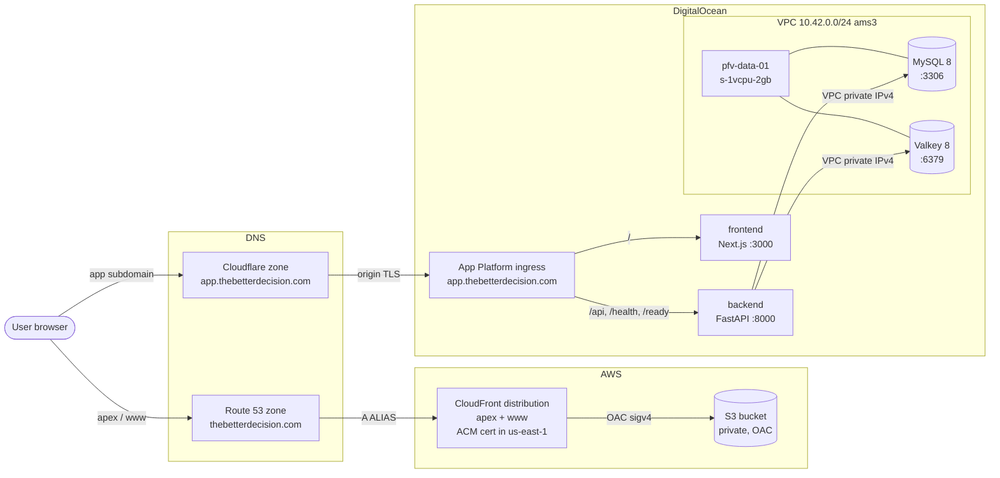
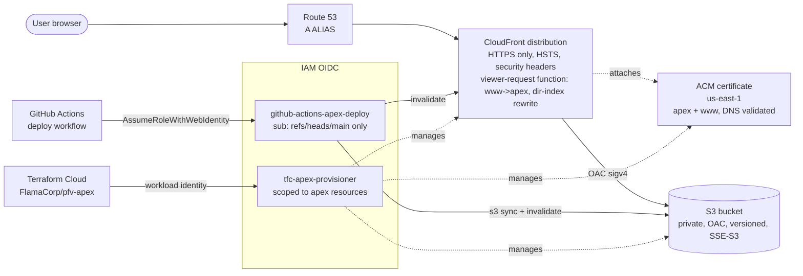

# pfv infra

End-to-end infrastructure for The Better Decision (pfv). Two clouds, two TFC
workspaces, one app.

- **AWS** owns the apex marketing landing site at `thebetterdecision.com`
  (S3 + CloudFront + ACM + IAM OIDC). Managed by Terraform Cloud workspace
  `FlamaCorp/pfv-apex` against `infra/terraform/apex/`.
- **DigitalOcean** owns the app itself at `app.thebetterdecision.com`
  (App Platform fronting the Next.js frontend and FastAPI backend) plus the
  self-hosted data plane (`pfv-data-01`: MySQL 8 + Valkey 8) inside a private
  VPC. Managed by Terraform Cloud workspace `FlamaCorp/pfv` against
  `infra/terraform/` (root + `modules/`).

App Platform spec lives at `.do/app.yaml`. The migration runbook for the
managed-DB to self-hosted-droplet cutover lives at `infra/MIGRATION.md`.
Per-env-var documentation lives at `ENVIRONMENT.md` (repo root). The
day-to-day deploy walkthrough lives at `DEPLOYMENT.md`.

## Topology



The boundary between AWS (apex landing) and DigitalOcean (app + data plane)
is a hard one. Different cloud, different auth, different TFC workspace.
The only thing they share is the `thebetterdecision.com` zone delegation
target (Route 53 holds the apex, Cloudflare holds the `app.` subdomain).

## What's here

```
infra/
├── README.md                       # this file
├── MIGRATION.md                    # managed MySQL+Redis -> droplet cutover (historical)
├── terraform/                      # DO data droplet (TFC: FlamaCorp/pfv)
│   ├── main.tf
│   ├── outputs.tf
│   ├── variables.tf
│   ├── modules/                    # vpc/, droplet/, firewall/, project/
│   └── apex/                       # AWS apex landing (TFC: FlamaCorp/pfv-apex)
│       ├── main.tf
│       ├── variables.tf
│       ├── outputs.tf
│       ├── providers.tf            # default region + us-east-1 alias for ACM
│       ├── versions.tf
│       └── README.md               # apex-specific bootstrap + IAM detail
└── ansible/                        # Ubuntu 24.04 bootstrap for pfv-data-01
```

## TFC workspaces

Both workspaces are VCS-driven against this repo, both require manual
Confirm & Apply on the TFC UI (no auto-apply), both run speculative plans
on PRs. See `feedback_terraform_vcs_only`: local CLI plan/apply is
debug-only.

| Workspace | Cloud | Working dir | Trigger pattern | Auth |
|---|---|---|---|---|
| `FlamaCorp/pfv` | DigitalOcean | `infra/terraform/` | `infra/terraform/**` (excludes `apex/`) | `do_token` workspace variable |
| `FlamaCorp/pfv-apex` | AWS | `infra/terraform/apex/` | `infra/terraform/apex/**` | OIDC workload identity (`TFC_AWS_PROVIDER_AUTH=true`, `TFC_AWS_RUN_ROLE_ARN=<tfc_role_arn output>`) |

The two workspaces deliberately have non-overlapping working directories.
A change under `infra/terraform/apex/` triggers `pfv-apex` only; a change
under `infra/terraform/main.tf` triggers `pfv` only. State is isolated.

## DNS

The apex moved to Route 53 with PR #240 (L5.2a). The app subdomain stays
on Cloudflare because it terminates origin TLS and proxies through to DO
App Platform's ingress. Mixed-zone setup is intentional, not transitional.

| Hostname | Authoritative DNS | Behind | Notes |
|---|---|---|---|
| `thebetterdecision.com` (apex) | Route 53 | CloudFront -> S3 | A + AAAA ALIAS records to CloudFront, provisioned by `infra/terraform/apex/main.tf`. |
| `www.thebetterdecision.com` | Route 53 | CloudFront -> S3 | A + AAAA ALIAS records to the same CloudFront distribution. CloudFront viewer-request function 301-redirects www traffic to apex after the TLS handshake. |
| `app.thebetterdecision.com` | Cloudflare | DO App Platform ingress | PRIMARY domain declared in `.do/app.yaml`. Cloudflare origin TLS handshake assumes this stays declared on the App Platform side; do not strip it from the spec. |
| `m.thebetterdecision.com` | Cloudflare | Mailgun EU | Outbound email only. |

Cloudflare was dropped from the apex (and only the apex) when L5.2a
shipped. It is NOT gone from the project.

## Apex landing (AWS)

Static-export marketing site at `https://thebetterdecision.com` and
`https://www.thebetterdecision.com`. Built by the Next.js apex export
(`out-apex/`), synced to S3 by GitHub Actions, served by CloudFront.



### Stack

| Resource | Notes |
|---|---|
| `aws_s3_bucket` | Private (all four public-access-block flags on), versioned, SSE-S3, lifecycle expires noncurrent versions after 90 days. |
| `aws_cloudfront_distribution` | `PriceClass_100` (NA + EU PoPs), HTTP/2 + HTTP/3, IPv6 on. CachingOptimized managed cache policy (hashed asset filenames are the cache-busting key). |
| `aws_cloudfront_origin_access_control` | OAC, not legacy OAI. SigV4 to the bucket. |
| `aws_cloudfront_function` | Viewer-request: www -> apex 301 redirect (runs first), then S3 directory-index rewrite (`/privacy/` -> `/privacy/index.html`). |
| `aws_cloudfront_response_headers_policy` | HSTS (`max-age=63072000; includeSubDomains; preload`), `X-Content-Type-Options: nosniff`, `X-Frame-Options: DENY`, `Referrer-Policy: strict-origin-when-cross-origin`, `Permissions-Policy`. CSP deferred to PR-C. |
| `aws_acm_certificate` | In `us-east-1`. CloudFront's API requires viewer-attached certs to live in `us-east-1` regardless of where the origin sits (see `infra/terraform/apex/providers.tf` for the alias-provider rationale). DNS validated. |
| `aws_route53_record.apex_acm_validation` | ACM `_<token>.<domain>` validation CNAMEs in the existing zone. Does NOT touch the apex A record. |
| `aws_iam_openid_connect_provider.github` | GitHub Actions OIDC trust. SHA-1 thumbprint computed at plan time via `tls_certificate` data source (AWS does not auto-rotate OIDC thumbprints). |
| `aws_iam_openid_connect_provider.tfc` | Terraform Cloud workload identity trust. Same thumbprint pattern. |
| `aws_iam_role.github_actions_apex_deploy` | Trust pinned via `StringEquals` to `repo:flamarion/pfv:ref:refs/heads/main`. PR-context tokens have a different `sub` and are rejected at the trust level (workflow `if:` guards alone are insufficient because PR authors can edit the workflow). Permissions scoped to this bucket + this distribution only. |
| `aws_iam_role.tfc_apex_provisioner` | Trust pinned to `FlamaCorp` org + `pfv-apex*` workspace pattern. Manages apex bucket + distribution + ACM cert + IAM role chain + Route 53 records. Route 53 writes are split into two narrow IAM statements (each pairs `route53:ChangeResourceRecordSetsRecordTypes` with `route53:ChangeResourceRecordSetsNormalizedRecordNames`): `A`/`AAAA` on exactly apex + www, and `CNAME` on the exact ACM validation names from `domain_validation_options`. Any other record type or name in the zone is IAM-blocked. |

### Why `us-east-1` for ACM

CloudFront requires viewer certs in `us-east-1`. The bucket is in
`var.aws_region` (default `eu-central-1`), but the cert provider in
`apex/providers.tf` uses the `aws.us_east_1` alias for the certificate
resource only. No other resource is pinned to that region.

### Why a separate TFC workspace

`FlamaCorp/pfv-apex` is split from `FlamaCorp/pfv` because:

- Different cloud (AWS vs DO) and different auth model (IAM OIDC vs DO
  API token), so the workspace credentials don't overlap.
- Smaller blast radius. An apex apply that breaks cannot affect MySQL or
  the App Platform app, and vice versa.
- The apex IAM role's permissions are tightly scoped; if everything sat
  in one workspace those scopes would have to widen.
- Independent run history makes apex incidents easier to triage on the
  TFC timeline.

### OIDC switchover

The first `pfv-apex` apply needs static AWS credentials to bootstrap the
OIDC providers themselves (the apex provisioner role doesn't exist
until this module applies). The sequence:

1. Create a short-lived `pfv-apex-bootstrap` IAM user with
   `AdministratorAccess`. Set `AWS_ACCESS_KEY_ID` /
   `AWS_SECRET_ACCESS_KEY` as sensitive env vars on the workspace.
2. Run the first apply via TFC. Module creates both OIDC providers
   (GitHub Actions, TFC), both roles (`github-actions-apex-deploy`,
   `tfc-apex-provisioner`), and the S3 + CloudFront + ACM resources.
3. Set `TFC_AWS_PROVIDER_AUTH=true` and
   `TFC_AWS_RUN_ROLE_ARN=<tfc_role_arn output>` on the workspace.
4. Delete `AWS_ACCESS_KEY_ID` / `AWS_SECRET_ACCESS_KEY` from the
   workspace. Delete (or deactivate) the `pfv-apex-bootstrap` IAM user.
5. Trigger an empty plan to confirm TFC reaches AWS via OIDC.

Full bootstrap detail (including the rationale for path B over a
manual-OIDC-first path A) lives in `infra/terraform/apex/README.md`.

### Cross-link

`infra/terraform/apex/README.md` is the canonical reference for:

- Bootstrap path (above) with the full owner-side checklist.
- Per-resource IAM scoping rationale.
- S3 directory-index handling behaviour matrix (URL -> expected response).
- Security notes (least privilege, OIDC thumbprint rotation, OAC vs OAI,
  header rationale).
- Module layout and rollback path.
- Cost breakdown (currently ~$1.10/mo new spend).

## DO App Platform

The `pfv` app fronts the live application. App ID and database IDs
shouldn't really be repeated outside of `reference_digitalocean.md`, but
the public-facing identifiers below are useful for operators reading this
file alone.

- **App URL:** `https://app.thebetterdecision.com`
- **DO-issued URL:** `https://pfv-xccvs.ondigitalocean.app` (still works,
  redirects)
- **App ID:** `3bcf70e8-2bae-4918-8297-ce430c79735e`
- **DO project:** `pfv` (`5c404689-358b-42c5-a8e2-f48a304d8298`)
- **Region:** `ams3`
- **VPC attachment:** `694e9d40-a08d-486a-becb-5d068e5ef5c5` (declared at
  the top of `.do/app.yaml`, required for App Platform to reach
  `pfv-data-01`'s private IPv4)

### Components

| Component | Kind | Source | Port | Instance | Notes |
|---|---|---|---|---|---|
| `backend` | service | `backend/` + `backend/Dockerfile` | 8000 | `basic-xxs` x 1 | FastAPI. Health probe `/health`. |
| `frontend` | service | `frontend/` + `frontend/Dockerfile` | 3000 | `basic-xxs` x 1 | Next.js standalone build. Health probe `/health`. |
| `migrate` | PRE_DEPLOY job | `backend/` + `backend/Dockerfile` | n/a | `basic-xxs` x 1 | `python /app/scripts/migrate.py`. Runs once per deploy before any backend replica starts (the canonical init-container pattern for App Platform). New revision is held back until the job exits 0, so a long migration never trips the backend's serving probe. Matching `initContainer` lives in the k8s/ Helm chart `templates/backend.yaml`. See `infra/MIGRATION.md` and the migrate wrapper at `backend/scripts/migrate.py`. |

### Ingress

App Platform handles routing; nginx (used in dev) is not in the prod path.

- `/api/*`, `/health`, `/ready` -> `backend` (with `preserve_path_prefix:
  true`)
- `/` (everything else) -> `frontend`

### Secrets

Encrypted (`EV[...]`) directly in `.do/app.yaml`. The encryption is
per-app, the blobs are unreadable outside DO, and they MUST be committed
because `app_spec_location: .do/app.yaml` means the deploy workflow pushes
the entire spec on every deploy. A missing SECRET disappears from the
live app on the next push (see the 2026-04-25 incident note in
`.do/app.yaml`).

The currently bound secrets are `DATABASE_URL`, `REDIS_URL`,
`JWT_SECRET_KEY`, `MFA_ENCRYPTION_KEY`, `MAILGUN_API_KEY`,
`GOOGLE_CLIENT_ID`, `GOOGLE_CLIENT_SECRET`. `ENVIRONMENT.md` is the
authoritative per-var reference.

### Deployment

Deploys go through GitHub Actions (`.github/workflows/deploy.yml`) on
merge to `main`. `deploy_on_push` is set to `false` in DO so the spec
push is exclusively driven by the workflow. See `DEPLOYMENT.md` for the
full walkthrough.

## DO data droplet (`pfv-data-01`)

Self-hosted MySQL + Valkey on a single DigitalOcean droplet, replacing
the DO Managed MySQL + Managed Redis pair (~$30/mo) with one
`s-1vcpu-2gb` droplet (~$12/mo). DO droplet snapshots are off; the
nightly mysqldump cron is the durability floor.

- **Region:** `ams3`
- **VPC:** `10.42.0.0/24` (Terraform-managed)
- **Engines:** MySQL 8 (`:3306`), Valkey 8 (`:6379`, drop-in Redis
  replacement)
- **Firewall:** single layer, DO cloud firewall `pfv-data-fw`
  (id `cd1f4b10-d9e4-48ca-83cd-2d75ab815bce`). UFW on the host is
  intentionally **disabled** as of PR #260. The previous two-layer
  setup (UFW + cloud firewall) was suspected of silent drops during
  VPC NAT translation; consolidating to one layer resolved the issue.
  The Ansible `common` role keeps UFW disabled idempotently.
- **Backups:** nightly `mysqldump` on the droplet
  (`/var/backups/mysql/`, log at `/var/log/mysql-backup.log`).

```
                     ┌────────────────────────────┐
                     │  DO App Platform (ams3)    │
                     │   backend + frontend       │
                     └──────────────┬─────────────┘
                                    │ VPC private IPv4
                                    ▼
              VPC 10.42.0.0/24 ┌────────────────────────────┐
                               │  pfv-data-01 (s-1vcpu-2gb) │
                               │   - MySQL 8 (3306)         │
                               │   - Valkey 8 (6379)        │
                               │   - cloud FW pfv-data-fw   │
                               │   - nightly mysqldump      │
                               └────────────────────────────┘
                                    ▲
                                    │ SSH (key auth), public IPv4
                                    │
                                  operator
```

DO Cloud Firewall: SSH 22 from any IPv4, MySQL 3306 + Valkey 6379 from
VPC CIDR only. ICMP from VPC.

## Prerequisites (DO side, `FlamaCorp/pfv`)

- A DO API token with read/write scope. In normal operation it lives as
  the `do_token` workspace variable in TFC; local CLI debug runs against
  the same workspace need `TF_VAR_do_token` (or a gitignored
  `terraform.tfvars`).
- An SSH key already registered in DO (Settings -> Security). Note its
  name.
- A DO project named `pfv` (or change `project_name`). Projects must be
  created from the UI or `doctl` first; Terraform does not manage them.
- Local tooling: `terraform >= 1.5`, `ansible >= 2.16`, `doctl`
  (optional, useful for sanity checks).

## Step-by-step (data droplet)

### 1. Provision (Terraform Cloud)

State and runs live in Terraform Cloud, workspace `FlamaCorp/pfv`,
VCS-driven against this repo with the working directory and trigger
paths both scoped to `infra/terraform/` (the apex workspace handles
`infra/terraform/apex/**` independently). Workflow:

1. Open a PR that touches `infra/terraform/**` (outside `apex/`). TFC
   posts a speculative plan on the run page.
2. Merge to `main`. TFC starts an apply run. Apply method is **manual
   Confirm & Apply** on the TFC UI.

The workspace expects two variables to be set ahead of time:

- `do_token` (sensitive): the DO API token.
- `ssh_key_name` (plaintext): the name of an SSH key already registered
  in DO.

After the apply succeeds, fetch the outputs from TFC (Workspace ->
Outputs) or via the CLI once `terraform login` is configured locally:

```bash
terraform -chdir=infra/terraform output droplet_public_ipv4
terraform -chdir=infra/terraform output droplet_private_ipv4
terraform -chdir=infra/terraform output -raw vpc_id
```

Local-CLI runs against the same workspace work too; `terraform login`
once, then `terraform plan` reaches the remote state.
`terraform.tfvars` is for local runs only and stays gitignored. The
`.terraform.lock.hcl` IS committed so TFC and laptops resolve identical
provider versions.

### 2. Configure (Ansible)

```bash
cd ../ansible
cp inventory.yml.example inventory.yml
$EDITOR inventory.yml
# Fill in:
#   ansible_host          = $(terraform -chdir=../terraform output -raw droplet_public_ipv4)
#   private_ipv4          = $(terraform -chdir=../terraform output -raw droplet_private_ipv4)
#   mysql_app_password    = <generated>
#   mysql_backup_password = <generated>
#   redis_password        = <generated>
#
# Note: we intentionally do NOT manage a password for root@localhost.
# Ubuntu MySQL ships with auth_socket on root, and we keep that. Local
# maintenance is `sudo mysql`. Cron mysqldump uses the dedicated
# mysql_backup user via /root/.my.cnf.

ansible-galaxy collection install -r requirements.yml
ansible-playbook playbooks/site.yml
```

Recommended: `ansible-vault encrypt_string` the three passwords or move
them into a vault-encrypted vars file. `inventory.yml` is gitignored to
keep plain-text creds out of the repo even by accident.

### 3. Wire App Platform

Update App Platform secrets (separate PR / runbook step):

```
DATABASE_URL=mysql+aiomysql://pfv_app:<password>@<droplet_private_ipv4>:3306/pfv2
REDIS_URL=redis://default:<password>@<droplet_private_ipv4>:6379/0
```

See `MIGRATION.md` for the full data-move runbook (including rollback).

## OIDC overview

Two OIDC trust relationships live in the apex AWS account:

- **GitHub Actions -> AWS**: `github-actions-apex-deploy` is assumable
  only by `flamarion/pfv` workflow runs whose token `sub` is exactly
  `repo:flamarion/pfv:ref:refs/heads/main`. PR-context tokens have a
  different `sub` and are rejected at the trust level, not just by
  workflow-level `if:` guards. Scope: `s3:Put/Delete/List` on the apex
  bucket and `cloudfront:CreateInvalidation` on the apex distribution.
- **Terraform Cloud -> AWS**: `tfc-apex-provisioner` is assumable only
  by TFC runs in `FlamaCorp/pfv-apex*` workspaces (any phase). Scope:
  the apex resource graph (S3 bucket, CloudFront distribution, ACM in
  `us-east-1`, the two IAM OIDC providers, the two IAM roles, Route 53
  read-only plus CNAME-only writes for ACM validation).

DO-side (`FlamaCorp/pfv`) does NOT use OIDC; it uses a long-lived
`do_token` workspace variable. DO Terraform Cloud OIDC for the DO
provider is not currently supported, so static-token auth is the path
there until further notice.

Full IAM trust-policy / scoping detail lives in
`infra/terraform/apex/README.md`. The bootstrap-to-OIDC switchover
sequence above is the operator-side summary; the apex README documents
why path B (static-key bootstrap then flip) won over path A (manual
console OIDC setup).

## Day-2

### Apex landing

- **Verify**: browse `https://thebetterdecision.com/` (or its
  `_meta.json` probe for a no-cache deploy-SHA echo). The
  CloudFront-assigned `dXXX.cloudfront.net` hostname from output
  `cloudfront_distribution_domain` remains available as a diagnostic
  / fallback path when the apex hostname is itself unreachable.
- **Invalidate cache**: GitHub Actions workflow invalidates on every
  deploy. Manual: `aws cloudfront create-invalidation
  --distribution-id <id> --paths '/*'`.
- **Cert rotation**: ACM auto-renews; DNS validation records stay in
  the zone permanently.
- **Cost**: ~$1.10/mo at current traffic.

### DO App Platform

- **Logs**: DO control panel -> Apps -> pfv -> Runtime Logs (per
  component) or `doctl apps logs <APP_ID> <component>`.
- **Deploys**: GitHub Actions `deploy.yml`. Manual fallback `doctl apps
  update <APP_ID> --spec .do/app.yaml`, but the GH Action is the
  documented path; see `reference_do_spec_sync.md` for the
  `app_action/deploy@v2` gotcha that mandates `app_spec_location`.

### Data droplet

- **Inspect droplet metrics**: DO control panel -> Droplets ->
  pfv-data-01 -> Graphs. CPU, memory, disk, network all graphed for
  free.
- **Watch backups**: `ls -lh /var/backups/mysql/` on the droplet. Logs
  at `/var/log/mysql-backup.log`.
- **Apply OS updates**: unattended-upgrades runs daily; reboots are
  manual. `sudo apt update && sudo apt upgrade && sudo reboot` during
  a quiet window.
- **Rotate creds**: re-run the playbook with new vault values; restart
  services as the handlers fire.

## Teardown

### Apex (`FlamaCorp/pfv-apex`)

Every resource in the apex module is `terraform destroy`-able. A full
teardown removes the apex / www `A` + `AAAA` ALIAS records, the ACM
validation CNAMEs, the bucket and distribution, the IAM roles, and the
OIDC providers. The apex hosted zone is data-sourced, not managed, so
it survives untouched. After teardown DNS for apex and www returns to
"no answer", and a fresh apply recreates everything end to end. Path:
open a PR removing the resources, merge, Confirm & Apply in TFC. Or
queue a Destroy plan from the TFC workspace UI.

### Data droplet (`FlamaCorp/pfv`)

Terraform is VCS-driven via TFC; teardown follows the same path. Either:

- Open a PR that removes (or comments out) the droplet / VPC / firewall
  resources in `infra/terraform/`. Merge it and run the apply via the
  TFC UI (Confirm & Apply), same as any other infra change.
- Or, for a one-shot destroy, queue a `Destroy plan` from the TFC
  workspace UI and approve it. Local `terraform destroy` is debug-only.

Warning: this destroys the droplet and its data. DO droplet snapshots
are disabled at the IaC level, so the only durability floor is the
nightly `mysqldump` on the droplet. Pull a final dump (see
`MIGRATION.md` for the command and the verify step) before queuing the
destroy.

## See also

- `infra/terraform/apex/README.md`: apex AWS workspace bootstrap,
  per-resource IAM scoping, security notes, behaviour matrix.
- `infra/MIGRATION.md`: managed-MySQL+Redis to droplet cutover (already
  executed; kept as the reference writeup).
- `ENVIRONMENT.md` (repo root): authoritative per-env-var reference for
  every component.
- `DEPLOYMENT.md` (repo root): GitHub Actions deploy walkthrough.
- `~/.claude/projects/-Users-fjorge-src-pfv/memory/reference_digitalocean.md`:
  DO IDs, gotchas, and operational lore.
- `~/.claude/projects/-Users-fjorge-src-pfv/memory/project_apex_s3_cloudfront.md`:
  L5.2a direction lock and decision log.
- `~/.claude/projects/-Users-fjorge-src-pfv/memory/feedback_terraform_vcs_only.md`:
  Terraform is VCS-driven; CLI is debug-only.
